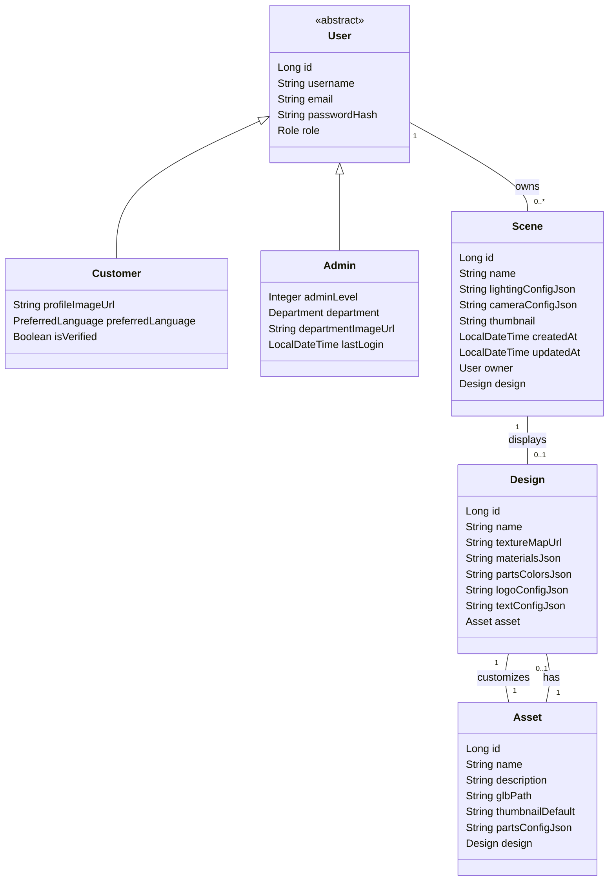

# sideForge

## Description of the project

**sideForge** is a RESTful API developed in Java with Spring Boot, focused on the management and customization of 3D assets (t-shirts, mugs, etc.) for web visualization and customization applications. The backend allows users to manage their accounts, view 3D assets, and personalize them through a flexible design system, including the application of colors, materials, logos, and texts on specific, predefined parts.

Authenticated users can create and modify 3D scenes, associate assets, and define personalized designs on different asset parts, as well as manage materials, logos, and texts applied to models.

---

## Class Diagram



---

## Domain Model and Structure

<details>
<summary><strong>Project Structure</strong></summary>

```plaintext
src/
├── assets/                           # Static files (images, logos, base assets, mockups, etc)
│   ├── logo/
│   ├── model/demo-asset.glb
│   └── schema/
│
├── main/
│   ├── java/
│   │   └── com/
│   │       └── sideForge/
│   │           └── app/
│   │               ├── config/
│   │               │   ├── SwaggerConfig.java
│   │               │   ├── WebSecurityConfig.java
│   │               │   └── AppConfig.java
│   │               │
│   │               ├── controller/
│   │               │   ├── UserController.java
│   │               │   ├── AssetController.java
│   │               │   ├── SceneController.java
│   │               │   └── DesignController.java
│   │               │
│   │               ├── dto/
│   │               │   ├── request/
│   │               │   │   ├── UserRequestDTO.java
│   │               │   │   ├── AssetRequestDTO.java
│   │               │   │   ├── SceneRequestDTO.java
│   │               │   │   └── DesignRequestDTO.java
│   │               │   │   ├── AdminRequestDTO.java
│   │               │   └── response/
│   │               │       ├── UserResponseDTO.java
│   │               │       ├── AssetResponseDTO.java
│   │               │       ├── SceneResponseDTO.java
│   │               │       ├── DesignResponseDTO.java
│   │               │       └── AdminResponseDTO.java
│   │               │
│   │               ├── enums/
│   │               │   ├── Role.java
│   │               │   ├── Part.java
│   │               │   ├── MaterialType.java
│   │               │   ├── PreferredLanguage.java
│   │               │   └── Department.java
│   │               │
│   │               ├── exception/
│   │               │   ├── ApiException.java
│   │               │   ├── GlobalExceptionHandler.java
│   │               │   ├── ResourceNotFoundException.java
│   │               │   └── ValidationException.java
│   │               │
│   │               ├── model/
│   │               │   ├── User.java
│   │               │   ├── Customer.java
│   │               │   ├── Admin.java
│   │               │   ├── Asset.java
│   │               │   ├── Scene.java
│   │               │   └── Design.java
│   │               │
│   │               ├── repository/
│   │               │   ├── UserRepository.java
│   │               │   ├── AssetRepository.java
│   │               │   ├── SceneRepository.java
│   │               │   └── DesignRepository.java
│   │               │
│   │               ├── security/
│   │               │   ├── JwtAuthenticationFilter.java
│   │               │   ├── JwtProvider.java
│   │               │   └── CustomUserDetailsService.java
│   │               │
│   │               ├── service/
│   │               │   ├── impl/
│   │               │   │   ├── UserServiceImpl.java
│   │               │   │   ├── AssetServiceImpl.java
│   │               │   │   ├── SceneServiceImpl.java
│   │               │   │   └── DesignServiceImpl.java
│   │               │   │
│   │               │   ├── UserService.java
│   │               │   ├── AssetService.java
│   │               │   ├── SceneService.java
│   │               │   └── DesignService.java
│   │               │
│   │               ├── util/
│   │               │   ├── DataLoader.java
│   │               │   ├── JsonUtil.java
│   │               │   └── PasswordEncoderUtil.java
│   │               │
│   │               └── SideForgeApplication.java
│   │
│   └── resources/
│       └── application.properties
│
└── test/
    └── java/
        └── com/
            └── sideForge/
                └── app/
                    ├── controller/
                    │   ├── UserControllerTest.java
                    │   ├── AssetControllerTest.java
                    │   ├── SceneControllerTest.java
                    │   └── DesignControllerTest.java
                    │
                    ├── service/
                    │   ├── impl/
                    │   │   ├── UserServiceImplTest.java
                    │   │   ├── AssetServiceImplTest.java
                    │   │   ├── SceneServiceImplTest.java
                    │   │   └── DesignServiceImplTest.java
                    │   │
                    │   ├── UserServiceTest.java
                    │   ├── AssetServiceTest.java
                    │   ├── SceneServiceTest.java
                    │   └── DesignServiceTest.java
                    │
                    ├── util/
                    │   └── JsonUtilTest.java
                    │
                    └── DataLoaderTest.java
```
</details>

___

### Explanation of the Classes and Relationships

#### User (abstract)
- **Base for users**, with role-based inheritance.
- **Attributes:**  
  - `id`, `username`, `email`, `passwordHash`, `role`
- **Inheritance:**  
  - `Customer`, `Admin` (JPA inheritance).

#### Customer
- **Extra attributes:**
  - `profileImageUrl`: User's profile image URL.
  - `preferredLanguage`: User's preferred language (enum `PreferredLanguage`, e.g. ES, EN, FR...).
  - `isVerified`: Boolean for verification status.

#### Admin
- **Extra attributes:**
  - `adminLevel`: Admin level (integer, higher = more privileges).
  - `department`: Admin's department (enum `Department`, e.g. IT, HR, SUPPORT...).
  - `departmentImageUrl`: Profile image based on department.
  - `lastLogin`: Last login date/time.

#### Asset
- Represents the **base 3D asset** (t-shirt, mug, etc.).
- **Attributes:**  
  - `id`, `name`, `description`, `glbPath`, `thumbnailDefault`
  - `partsConfigJson`: JSON with customizable parts definition (e.g. `{ "neck": {...}, "right_sleeve": {...} }`)
  - **Relation:**  
    - `design`: Unique base design associated with the asset (`Design`).

#### Scene
- Represents the **3D scene** (camera, lights, loaded asset, etc.).
- **Attributes:**  
  - `id`, `name`, `lightingConfigJson`, `cameraConfigJson`, `thumbnail`, `createdAt`, `updatedAt`
  - `owner`: Scene's owner user.
  - **Relation:**  
    - `design`: Design shown in the scene, associated and customized.

#### Design
- **Customization** of an asset (texture, colors, materials, logos/texts).
- **Attributes:**  
  - `id`, `name`
  - `textureMapUrl`: Custom base texture (UV).
  - `materialsJson`, `partsColorsJson`, `logoConfigJson`, `textConfigJson`: JSONs with materials, colors, logo, and text data.
  - **Relation:**  
    - `asset`: Base asset being customized (1:1).

---

<details>
<summary><strong>Enums</strong></summary>

**Part** (customizable parts, per asset)
```java
public enum Part {
    PECHO,
    PECHO_IZQ,
    ESPALDA,
    ESPALDA_NUCA,
    MANGA_DCHA,
    MANGA_IZQ,
    CUELLO,
    ASA,
    BASE,
    INTERIOR,
    LATERAL_DCHA,
    LATERAL_IZQ
}
```

**MaterialType** (available materials)
```java
public enum MaterialType {
    ALGODON,
    POLIESTER,
    LANA,
    CUERO,
    CERAMICA,
    PLASTICO,
    METAL,
    NYLON,
    SEDA,
    VAQUERO,
    PORCELANA,
    GOMA,
    MADERA
}
```

**PreferredLanguage** (supported user languages)
```java
public enum PreferredLanguage {
    ES,     // Spanish
    EN,     // English
    FR,     // French
    DE,     // German
    IT,     // Italian
    PT,     // Portuguese
    // Add more as needed
}
```

**Department** (admin departments)
```java
public enum Department {
    IT,
    HR,
    SUPPORT,
    SALES,
    MARKETING,
    DESIGN,
    FINANCE,
    // Add more as needed
}
```
</details>

---

<details>
<summary><strong>Testing</strong></summary>

- **Controllers:**  
  Use `@WebMvcTest` + `MockMvc` for HTTP request simulation and response validation without full context.
- **Services:**  
  Use `@ExtendWith(MockitoExtension.class)` and repository mocks for business logic testing.

**Service test example:**
```java
@Test
void testGetDesignById() {
    Design mockDesign = new Design();
    mockDesign.setId(1L);
    when(designRepository.findById(1L)).thenReturn(Optional.of(mockDesign));
    Design result = designService.getDesignById(1L);
    assertEquals(1L, result.getId());
}
```

**Controller test example:**
```java
@Test
void testGetAssetById() throws Exception {
    AssetResponseDTO mockAsset = new AssetResponseDTO();
    mockAsset.setId(1L);
    when(assetService.getAssetById(1L)).thenReturn(mockAsset);

    mockMvc.perform(get("/assets/1"))
            .andExpect(status().isOk())
            .andExpect(jsonPath("$.id").value(1L));
}
```
</details>

---

## Setup

1. **Clone the repository:**
   ```bash
   git clone https://github.com/krub-dev/sideForge.git
   cd sideForge
   ```

2. **Configure the application:**
   - Edit `src/main/resources/application.properties` with your database and environment settings.

3. **Install dependencies and build:**
   ```bash
   ./mvnw clean install
   ```

4. **Run the application:**
   ```bash
   ./mvnw spring-boot:run
   ```

5. **Test endpoints:**  
   The API will be available at `http://localhost:8080`.

---

## Technologies Used

- Java 17+
- Spring Boot
- Spring Data JPA
- Spring Security + JWT (TBD, extra)
- Validation (Jakarta)
- MySQL
- Maven
- Lombok
- Swagger/OpenAPI (for API documentation)
- Postman (testing endpoints)
- JUnit & Mockito (testing)
- Docker (TBD, for deployment, extra)
- Mermaid (UML diagram)

---

## Controllers and Routes structure

### UserController (`/users`)
- `POST /register` — Register user (Customer by default)
- `POST /login` — User login (optional JWT)
- `GET /profile` — Get authenticated user profile
- `GET /{id}` — Get user data by ID (admin only)
- `PUT /{id}` — Edit user (profile)
- `DELETE /{id}` — Delete user (admin/self)

### AssetController (`/assets`)
- `GET /` — List all 3D assets
- `GET /{id}` — Get asset details
- `POST /` — Create asset (admin only)
- `PUT /{id}` — Edit asset (admin only)
- `DELETE /{id}` — Delete asset (admin only)

### SceneController (`/scenes`)
- `GET /` — List authenticated user's scenes
- `GET /{id}` — Get scene details
- `POST /` — Create new scene
- `PUT /{id}` — Edit scene
- `DELETE /{id}` — Delete scene

### DesignController (`/designs`)
- `GET /` — List authenticated user's designs
- `GET /{id}` — Get design detail
- `POST /` — Create a new custom design
- `PUT /{id}` — Edit design
- `DELETE /{id}` — Delete design

#### DTOs by Entity

- **UserRequestDTO**: username, email, password, role (optional/admin)
- **UserResponseDTO**: id, username, email, role

- **CustomerRequestDTO**: username, email, password, profileImageUrl, preferredLanguage, isVerified
- **CustomerResponseDTO**: id, username, email, profileImageUrl, preferredLanguage, isVerified

- **AdminRequestDTO**: username, email, password, adminLevel, department, departmentImageUrl, lastLogin
- **AdminResponseDTO**: id, username, email, adminLevel, department, departmentImageUrl, lastLogin

- **AssetRequestDTO**: name, description, glbPath, thumbnailDefault, partsConfigJson
- **AssetResponseDTO**: id, name, description, glbPath, thumbnailDefault, partsConfigJson

- **SceneRequestDTO**: name, lightingConfigJson, cameraConfigJson, thumbnail, designId
- **SceneResponseDTO**: id, name, lightingConfigJson, cameraConfigJson, thumbnail, createdAt, updatedAt, designId, ownerId

- **DesignRequestDTO**: name, textureMapUrl, materialsJson, partsColorsJson, logoConfigJson, textConfigJson, assetId
- **DesignResponseDTO**: id, name, textureMapUrl, materialsJson, partsColorsJson, logoConfigJson, textConfigJson, assetId

---

## Resources

- **Kanban Board:** [Kanban's link]() 
- **Presentation Slides:** [Presentation's link]()
- **API Docs (Swagger):** `/swagger-ui.html`

---

## Future Work

- JWT/role authentication.
- Cloud image storage.
- Design versioning.
- Admin panel.
- 3D integration (Babylon.js or Three.js, TBD).
- Framework usage (Vue.js or React, TBD).
- Docker for deployment.
- Possible microservices refactor (users/auth and main logic separated with Eureka).

---

## Architecture Considerations

- **Domain separation:** The system may be split into two microservices: one for users/authentication (with Eureka Service Discovery) and another for main logic (assets, scenes, designs).
- **Decoupled databases:** Consider an independent database for each microservice.
