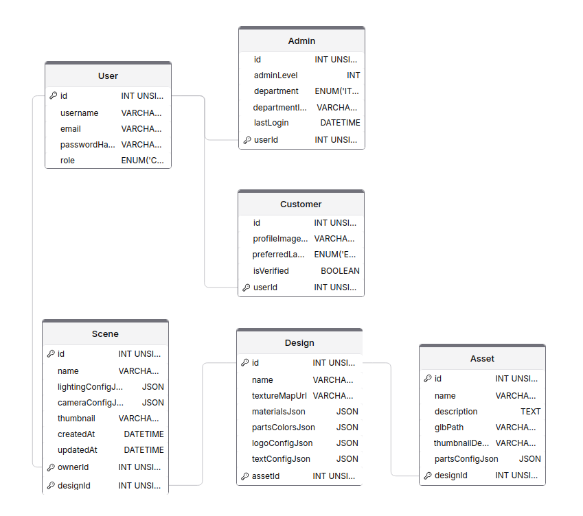

## Description of the project

**sideForge** is a RESTful API developed in Java with Spring Boot, focused on the management and customization of 3D assets (t-shirts, mugs, etc.) for web visualization and customization applications. The backend allows users to manage their accounts, view 3D assets, and personalize them through a flexible design system, including the application of colors, materials, logos, and texts on specific, predefined parts.

Authenticated users can create and modify 3D scenes, associate assets, and define personalized designs on different asset parts, as well as manage materials, logos, and texts applied to models.

---

## Class Diagram



---

## Domain Model and Structure

<details>
<summary><strong>Project Structure</strong></summary>

```plaintext
src/
├── assets/
│   ├── logo/
│   ├── schema/
│   ├── docs/
│   ├── test-report/
│   └── visual-resources/
│
├── main/
│   ├── java/
│   │   └── com/
│   │       └── sideforge/
│   │           ├── config/
│   │           │   └── OpenApiConfig.java
│   │           ├── controller/
│   │           │   ├── AdminController.java
│   │           │   ├── AssetController.java
│   │           │   ├── CustomerController.java
│   │           │   ├── DesignController.java
│   │           │   ├── SceneController.java
│   │           │   └── UserController.java
│   │           ├── dto/
│   │           │   ├── admin/
│   │           │   │   ├── AdminRequestDTO.java
│   │           │   │   ├── AdminResponseDTO.java
│   │           │   │   └── AdminUpdateDTO.java
│   │           │   ├── asset/
│   │           │   │   ├── AssetRequestDTO.java
│   │           │   │   ├── AssetResponseDTO.java
│   │           │   │   └── AssetUpdateDTO.java
│   │           │   ├── customer/
│   │           │   │   ├── CustomerRequestDTO.java
│   │           │   │   ├── CustomerResponseDTO.java
│   │           │   │   └── CustomerUpdateDTO.java
│   │           │   ├── design/
│   │           │   │   ├── DesignRequestDTO.java
│   │           │   │   ├── DesignResponseDTO.java
│   │           │   │   └── DesignUpdateDTO.java
│   │           │   ├── scene/
│   │           │   │   ├── SceneRequestDTO.java
│   │           │   │   ├── SceneResponseDTO.java
│   │           │   │   └── SceneUpdateDTO.java
│   │           │   └── user/
│   │           │       ├── UserRequestDTO.java
│   │           │       ├── UserResponseDTO.java
│   │           │       └── UserUpdateDTO.java
│   │           ├── enums/
│   │           │   ├── Department.java
│   │           │   ├── MaterialType.java
│   │           │   ├── Part.java
│   │           │   ├── PreferredLanguage.java
│   │           │   └── Role.java
│   │           ├── exception/
│   │           │   ├── ApiErrorResponse.java
│   │           │   ├── BadRequestException.java
│   │           │   ├── GlobalExceptionHandler.java
│   │           │   ├── InvalidCredentialsException.java
│   │           │   ├── ResourceNotFoundException.java
│   │           │   └── UsernameAlreadyExistsException.java
│   │           ├── model/
│   │           │   ├── Admin.java
│   │           │   ├── Asset.java
│   │           │   ├── Customer.java
│   │           │   ├── Design.java
│   │           │   ├── Scene.java
│   │           │   └── User.java
│   │           ├── repository/
│   │           │   ├── AdminRepository.java
│   │           │   ├── AssetRepository.java
│   │           │   ├── CustomerRepository.java
│   │           │   ├── DesignRepository.java
│   │           │   ├── SceneRepository.java
│   │           │   └── UserRepository.java
│   │           ├── security/
│   │           │   └── SecurityConfig.java
│   │           ├── service/
│   │           │   ├── impl/
│   │           │   │   ├── AdminServiceImpl.java
│   │           │   │   ├── AssetServiceImpl.java
│   │           │   │   ├── CustomerServiceImpl.java
│   │           │   │   ├── DesignServiceImpl.java
│   │           │   │   ├── SceneServiceImpl.java
│   │           │   │   └── UserServiceImpl.java
│   │           │   └── interfaces/
│   │           │       ├── AdminService.java
│   │           │       ├── AssetService.java
│   │           │       ├── CustomerService.java
│   │           │       ├── DesignService.java
│   │           │       ├── SceneService.java
│   │           │       └── UserService.java
│   │           ├── util/
│   │           │   └── DataLoader.java
│   │           └── SideForgeApplication.java
│   └── resources/
│       ├── application.properties
│       ├── static/
│       └── templates/
│
└── test/
    └── java/
        └── com/
            └── sideforge/
                ├── controller/
                │   ├── AdminControllerTest.java
                │   ├── AssetControllerTest.java
                │   ├── CustomerControllerTest.java
                │   ├── DesignControllerTest.java
                │   ├── SceneControllerTest.java
                │   └── UserControllerTest.java
                ├── service/
                │   └── impl/
                │       ├── AdminServiceImplTest.java
                │       ├── AssetServiceImplTest.java
                │       ├── CustomerServiceImplTest.java
                │       ├── DesignServiceImplTest.java
                │       ├── SceneServiceImplTest.java
                │       └── UserServiceImplTest.java
                ├── util/
                │   └── DataLoaderTest.java
                └── SideForgeApplicationTests.java
```

</details>

---

### UserController (`/api/users`)
-   `GET /` — List all users
-   `GET /page` — Get paginated users (query params: page, size, sort)
-   `GET /page/role/{role}` — Get paginated users by role (path param: role, query params: page, size, sort)
-   `GET /{id}` — Get user by ID
-   `PUT /{id}` — Update user by ID
-   `DELETE /{id}` — Delete user by ID

### AdminController (`/api/admins`)
-   `GET /` — List all administrators
-   `GET /page` — Get paginated administrators (query params: page, size, sort)
-   `GET /{id}` — Get administrator by ID
-   `POST /` — Create administrator
-   `PUT /{id}` — Update administrator by ID
-   `DELETE /{id}` — Delete administrator by ID

### CustomerController (`/api/customers`)
-   `GET /` — List all customers
-   `GET /page` — Get paginated customers (query params: page, size, sort)
-   `GET /{id}` — Get customer by ID
-   `POST /` — Create customer
-   `PUT /{id}` — Update customer by ID
-   `DELETE /{id}` — Delete customer by ID

### AssetController (`/api/assets`)
-   `GET /` — List all assets
-   `GET /page` — Get paginated assets (query params: page, size, sort)
-   `GET /search` — Search assets by name (query param: name, paginated + sort)
-   `GET /{id}` — Get asset by ID
-   `POST /` — Create asset
-   `PUT /{id}` — Update asset by ID
-   `DELETE /{id}` — Delete asset by ID
-   `GET /{id}/designs` — List all designs for an asset

### DesignController (`/api/designs`)
-   `GET /` — List all designs
-   `GET /page` — Get paginated designs (query params: page, size, sort)
-   `GET /by-asset/{assetId}` — Get design by assetId (path param: assetId)
-   `GET /by-assets` — Get designs by assetIds (query param: assetIds, paginated + sort)
-   `GET /{id}` — Get design by ID
-   `POST /` — Create design
-   `PUT /{id}` — Update design by ID
-   `DELETE /{id}` — Delete design by ID

### SceneController (`/api/scenes`)
-   `GET /` — Not implemented, use `/page`
-   `GET /page` — Get paginated scenes (query params: page, size, sort)
-   `GET /by-owner` — Get scenes by owner (query param: ownerId, paginated + sort)
-   `GET /by-name-and-owner` — Get scene by name and owner (query params: name, ownerId)
-   `GET /created-between` — Get scenes created between dates (query params: start, end, paginated + sort)
-   `GET /count-by-owner` — Count scenes by owner (query param: ownerId)
-   `GET /{id}` — Get scene by ID
-   `POST /` — Create scene
-   `PUT /{id}` — Update scene by ID
-   `DELETE /{id}` — Delete scene by ID

---

<details>
<summary><strong>DTOs by Entity</strong></summary>

-   **User**

    -   **UserRequestDTO**: username, email, password, role (optional/admin)
    -   **UserResponseDTO**: id, username, email, role
    -   **UserUpdateDTO**: username, email, password, profileImageUrl, preferredLanguage, isVerified

-   **Customer**

    -   **CustomerRequestDTO**: username, email, password, profileImageUrl, preferredLanguage, isVerified
    -   **CustomerResponseDTO**: id, username, email, profileImageUrl, preferredLanguage, isVerified
    -   **CustomerUpdateDTO**: profileImageUrl, preferredLanguage, isVerified

-   **Admin**

    -   **AdminRequestDTO**: username, email, password, adminLevel, department, departmentImageUrl, lastLogin
    -   **AdminResponseDTO**: id, username, email, adminLevel, department, departmentImageUrl, lastLogin
    -   **AdminUpdateDTO**: adminLevel, department, departmentImageUrl, lastLogin

-   **Asset**

    -   **AssetRequestDTO**: name, description, glbPath, thumbnailDefault, partsConfigJson
    -   **AssetResponseDTO**: id, name, description, glbPath, thumbnailDefault, partsConfigJson
    -   **AssetUpdateDTO**: name, description, glbPath, thumbnailDefault, partsConfigJson

-   **Scene**

    -   **SceneRequestDTO**: name, lightingConfigJson, cameraConfigJson, thumbnail, designId
    -   **SceneResponseDTO**: id, name, lightingConfigJson, cameraConfigJson, thumbnail, createdAt, updatedAt, designId, ownerId
    -   **SceneUpdateDTO**: name, lightingConfigJson, cameraConfigJson, thumbnail, designId

-   **Design**
    -   **DesignRequestDTO**: name, textureMapUrl, materialsJson, partsColorsJson, logoConfigJson, textConfigJson, assetId
    -   **DesignResponseDTO**: id, name, textureMapUrl, materialsJson, partsColorsJson, logoConfigJson, textConfigJson, assetId
    -   **DesignUpdateDTO**: name, textureMapUrl, materialsJson, partsColorsJson, logoConfigJson, textConfigJson, assetId

---

</details>

---

<details>
<summary><strong>Enums</strong></summary>

**Part** (customizable parts, per asset)

```java
public enum Part {
    // T-SHIRT
    CHEST,
    LEFT_CHEST,
    RIGHT_CHEST,
    BACK,
    BACK_NECK,
    RIGHT_SLEEVE,
    LEFT_SLEEVE,
    COLLAR,
    INSIDE_LABEL, // Inner area for size or brand label

    // MUG
    HANDLE,
    BASE,
    INTERIOR,
    RIGHT_SIDE,
    LEFT_SIDE,

    // MOUSE PAD
    SURFACE,
    EDGE,
    BOTTOM
}
```

**MaterialType** (available materials)

```java
public enum MaterialType {
    // CLOTHING MATERIALS (Materiales para ropa)
    COTTON,           // Algodón
    POLYESTER,        // Poliéster
    WOOL,             // Lana
    LEATHER,          // Cuero
    NYLON,            // Nailon
    SILK,             // Seda
    DENIM,            // Vaquero/Denim

    // RUBBER & ELASTOMERS (Goma y elastómeros)
    RUBBER,           // Goma
    LATEX,            // Látex
    SILICONE,         // Silicona

    // PAPER & CARDBOARD (Papel y cartón)
    PAPER,            // Papel
    CARDBOARD,        // Cartón

    // WOOD (Madera)
    PINE,             // Pino
    OAK,              // Roble
    BEECH,            // Haya

    // METALS (Metales)
    STAINLESS_STEEL,  // Acero inoxidable
    ALUMINUM,         // Aluminio
    IRON              // Hierro
}
```

**PreferredLanguage** (supported user languages)

```java
public enum PreferredLanguage {
    ES,    // Español (Spanish)
    EN,    // Inglés (English)
    FR,    // Francés (French)
    DE,    // Alemán (German)
    IT     // Italiano (Italian)
}
```

**Department** (admin departments)

```java
public enum Department {
    IT,       // Technology (Tecnología)
    HR,       // Human Resources (Recursos Humanos)
    SUPPORT,  // Soporte (Atención al cliente)
    SALES,    // Ventas
    DESIGN    // Diseño
}
```

</details>

---

<details>
<summary><strong>Testing</strong></summary>

-   **Controllers:**  
    Use `@WebMvcTest` and `MockMvc` to simulate HTTP requests and validate responses. Controller tests are located in `src/test/java/com/sideForge/app/controller/` and cover all endpoints for users, assets, scenes, and designs.

-   **Services:**  
    Use `@ExtendWith(MockitoExtension.class)` and mock repositories to test business logic in isolation. Service tests are located in `src/test/java/com/sideForge/app/service/impl/` and cover all service implementations.

-   **DataLoader:**  
    Initial data loading logic is tested in `src/test/java/com/sideForge/app/DataLoaderTest.java`.

</details>

<details>
<summary><strong>Exceptions</strong></summary>

-   **ApiException**  
    Custom base exception for API errors. Used to return structured error responses with a message and HTTP status.

-   **GlobalExceptionHandler**  
    Handles all exceptions thrown in controllers. Converts exceptions into standardized HTTP responses (with error message, status, and timestamp).

-   **ResourceNotFoundException**  
    Thrown when a requested resource (user, asset, scene, design, etc.) does not exist. Returns a 404 Not Found response.

-   **ValidationException**  
    Thrown when input data fails validation (e.g., missing required fields, invalid formats). Returns a 400 Bad Request response.

</details>

<details>
<summary><strong>Security</strong></summary>

-   **Spring Security** is configured in `config/WebSecurityConfig.java` to secure all endpoints.
-   **Role-based access:**
    -   Endpoints are protected based on user roles (`CUSTOMER`, `ADMIN`).
    -   Only `ADMIN` users can create, update, or delete assets and access certain user data.
    -   Regular users (`CUSTOMER`) can only access and modify their own resources.
-   **Password encoding:**
    -   Passwords are securely hashed using a password encoder utility.
-   **Authentication:**
    -   Basic authentication is enabled for testing.
    -   JWT authentication is prepared but not enabled by default.
-   **Test admin user:**
    -   A default admin user is created on startup for endpoint testing:
        -   **Username:** `admin`
        -   **Password:** `admin`
        -   **Role:** `ADMIN`
    -   You can use these credentials to test all admin-only endpoints.

</details>

<details>
<summary><strong>OpenAPI & Swagger</strong></summary>

-   **Swagger/OpenAPI** is configured via `config/SwaggerConfig.java`.
-   Interactive API documentation is available at: [http://localhost:8081/swagger-ui.html](http://localhost:8081/swagger-ui.html)

</details>

<details>
<summary><strong>Postman Collection</strong></summary>

-   The full Postman collection for demo/testing is available at:
    [`assets/docs/sideForge-demo-structured.postman_collection.json`](assets/docs/sideForge-demo-structured.postman_collection.json)
-   This collection covers registration, authentication, CRUD flows, pagination, and role-based access examples.
-   You can import it directly into Postman for quick API testing.

</details>

---

## Setup

1. **Clone the repository:**

    ```bash
    git clone https://github.com/krub-dev/sideForge.git
    cd sideForge
    ```

2. **Configure the application:**

    - Edit `src/main/resources/application.properties` with your database and environment settings.

3. **Install dependencies and build:**

    ```bash
    mvn clean install
    ```

4. **Run the application:**

    ```bash
    mvn spring-boot:run
    ```

5. **Test endpoints:**  
   The API will be available at `http://localhost:8081`.

---

## Technologies Used

-   Java 17+
-   Spring Boot
-   Spring Data JPA
-   Spring Security (role based, simplified)
-   Validation (Jakarta)
-   MySQL
-   Maven (dependencies)
-   Lombok
-   Swagger/OpenAPI (for API documentation)
-   Postman (testing endpoints)
-   Dbeaver (data base)
-   JUnit & Mockito (testing)

---

## Resources

-   **Kanban Board:** [Kanban's link](https://github.com/users/krub-dev/projects/2)
-   **Presentation Slides:** [Presentation's link](https://gamma.app/docs/Your-Vision-Visualized-8x4bz2i70z8ek1j?)
-   **API Docs (Swagger):** `/swagger-ui.html`

---

## Future Work

-   JWT authentication implemented.
-   Cloud image storage.
-   Design versioning.
-   Admin panel.
-   3D integration (Babylon.js or Three.js, TBD).
-   Framework front (Vue.js or React, TBD).
-   Docker for deployment.
-   Possible microservices refactor (users/auth and main logic separated with Eureka).

---

## Architecture Considerations

-   **Domain separation:** The system may be split into two microservices: one for users/authentication (with Eureka Service Discovery) and another for main logic (assets, scenes, designs).
-   **Decoupled databases:** Consider an independent database for each microservice.
-   **Scalability & Extensibility:** The architecture is designed to allow easy addition of new asset types, customization features, or integrations (e.g., payment, analytics, external 3D services) with minimal impact on existing code.

---
👤 Developer

- GitHub: [@krub-dev](https://github.com/krub-dev)
- LinkedIn: [Kiko Rubio Illán](https://www.linkedin.com/in/kiko-rubio-illan/)
- Portfolio: [krub.dev](https://krub.dev)
